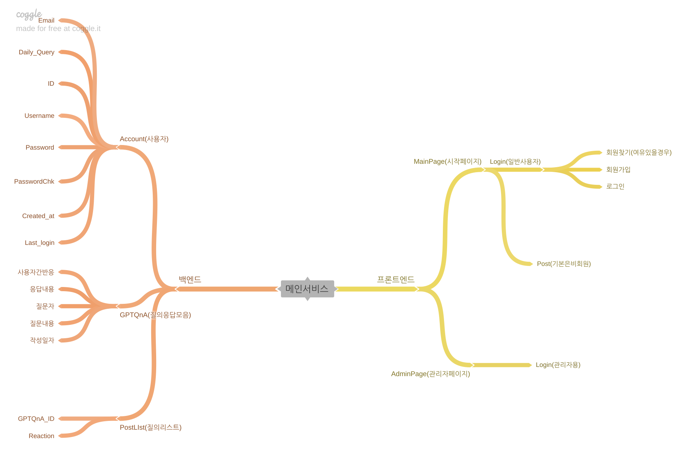

# DRFProject_Back

## 00. 개요
### 1. 목표
 - JS와 Django를 각각의 Repo로 구현하여 DRF를 통해 웹서비스를 프런트엔드와 백엔드로 구현
### 2. 구성 마인드맵
 


## 01. 진행과정
### 23.07.26 AM 09:05 Front와 Back의 구성 기획

### 23.07.26 AM 09:50 Django Model 구성
 #### 01. Django 가상환경구성
  ```shell
  python -m venv venv                                   # python -m venv (가상환경이름) 으로 가상환경 생성
  ./venv/Scripts/Activate.ps1                           # 생성된 가상환경 실행
  (venv) python -m pip install --upgrade pip            # pip 최신버전으로 업그레이드
  (venv) python -m pip install django                   # Django 설치
  (venv) python -m pip install djangorestframework      # DjangoRestFramewokr 설치
  ```
   - 해당 시점의 가상환경의 구성

  ```shell
  (venv) python -m pip list                            # pip로 설치한 라이브러리의 목록을 확인
   Package             Version
   ------------------- -------
   asgiref             3.7.2
   Django              4.2.3
   djangorestframework 3.14.0
   pip                 23.2.1
   pytz                2023.3
   setuptools          65.5.0
   sqlparse            0.4.4
   tzdata              2023.3
  ```

 #### 02. DjangoApp구성 및 settings.py 기본설정
  ```shell
  (venv) django-admin startproject QnAbot .      # django-admin startproject (프로젝트명) . 을 통해 현재위치에 프로젝트명의 프로젝트 생성 **1 **2
  (venv) django-admin startapp account           # djagno-admin startapp으로 각각의 내부 애플리케이션생성(사용자)
  (venv) djagno-admin startapp GPTQnA            # 해당 프로젝트의 GPT질의를 정리하는 app
  (venv) django-admin startapp Post              # GPTQnA를 참조해서 화면으로 출력할 내용을 가공하는 앱
  ```
   - **1 마지막의 . 을 넣지 않을 경우 Projectname/Projectname(생성된프로젝트폴더)의 구조로 생성됨
   - **2 같은 폴더 내에서 프로젝트를 새로 생성할 경우 프로젝트폴더와 manage.py를 같이 삭제하고 첫 줄의 명령어를 다시입력하는 것으로 가능

  ```python
  # Application definition

  INSTALLED_APPS = [
      'django.contrib.admin',
      'django.contrib.auth',
      'django.contrib.contenttypes',
      'django.contrib.sessions',
      'django.contrib.messages',
      'django.contrib.staticfiles',
      # django lib
      'restframework',
      # django cumtom app
      'account',
      'GPTQnA',
      'post',
  ]
  ```
  - 라이브러리와 생성한 앱을 추가

  ```python
  MIDDLEWARE = [
    'django.middleware.security.SecurityMiddleware',
    'django.contrib.sessions.middleware.SessionMiddleware',
    'django.middleware.common.CommonMiddleware',
    'django.middleware.csrf.CsrfViewMiddleware',
    'django.middleware.locale.LocaleMiddleware',
    'django.contrib.auth.middleware.AuthenticationMiddleware',
    'django.contrib.messages.middleware.MessageMiddleware',
    'django.middleware.clickjacking.XFrameOptionsMiddleware',
  ]
  ```
  - 'django.middleware.locale.LocaleMiddleware', 을 통해 번역기능을 준비

  ```python
  LANGUAGE_CODE = 'ko-kr'    # django에서 출력할 언어를 한국어로 변경
 
  TIME_ZONE = 'Asia/Seoul'   # djagno에서 사용할 DB의 시간대 설정
 
  USE_I18N = True            # django 번역 시스템 활성화(비활성화는 False)
 
  USE_L10N = True            # django 현지화 데이터 형식 사용(비사용은 False나 없음)
 
  USE_TZ = False              # 시간대 인식 여부 설정(Default는 True)
  ```
  - django의 경우 기본 언어는 'en-us'이고 시간대는 GTP-0를 기준으로 하고 있어 한국에 맞게 변경
  
 - 추후 추가적인 부분들 static, locale, media 등의 필요한 요소는 차후 설정
 - 23.07.26 AM 10:20 장고기본설정 완료

### 23.07.26 AM 10:22 장고설정 완료


## 02.


## 03.


## 04.


## 05.


### 00.


### 01.


### 02.


### 03.


### 04.


### 05.

